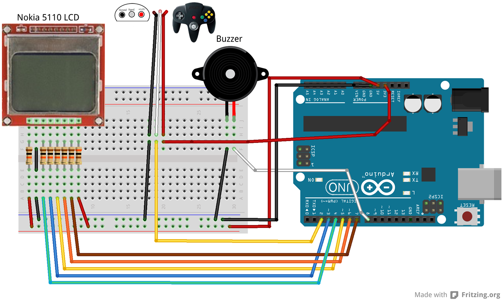
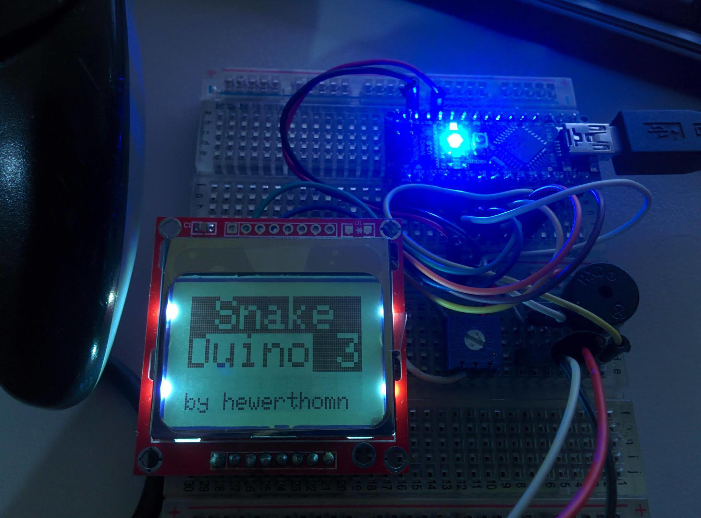

# Snake Duino III

Snake game with Arduino and controlled by N64 Controller

Video https://vimeo.com/80725135

## Components
- Arduino Uno/Nano
- Nokia 5110 LCD attached to pins 7, 6, 5, 4, 3
- Active Buzzer attached to pin 8
- N64 Controller attached to pin 2

## Libraries
- Adafruit GFX     https://github.com/adafruit/Adafruit-GFX-Library
- Adafruit PCD8544 https://github.com/adafruit/Adafruit-PCD8544-Nokia-5110-LCD-library
- N64Controller    http://pothos.blogsport.eu/files/2012/03/N64Controller.zip

## License
THE BEER-WARE LICENSE" (Revision 42):
[phk@FreeBSD.ORG]() wrote this file. As long as you retain this notice you
can do whatever you want with this stuff. If we meet some day, and you think
this stuff is worth it, you can buy me a beer in return Poul-Henning Kamp
